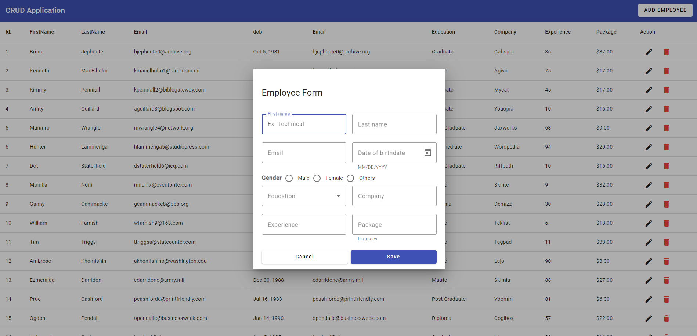

# CRUD Project in Angular with Angular Material UI 
This is a small example project that demonstrates how to create a CRUD (Create, Read, Update, Delete) application in Angular using Angular Material UI for the user interface and JSON-Server as a backend to simulate a database.

### Installation
Follow these steps to run the project on your local machine:

1. Clone this repository or download it as a ZIP file.
```
git clone git@github.com:David171901/angular-crud-material-ui.git
```
2. Navigate to the project directory.
```
cd crud-angular-json-server
```
3. Install the frontend and backend dependencies.
```
npm install
```
4. Start JSON-Server to simulate the backend. This will start a simulated JSON server at http://localhost:3000.
```
json-server --watch db.json
```
5. Start the Angular application in a new terminal. This will launch the application at http://localhost:4200.
```
ng serve
```

